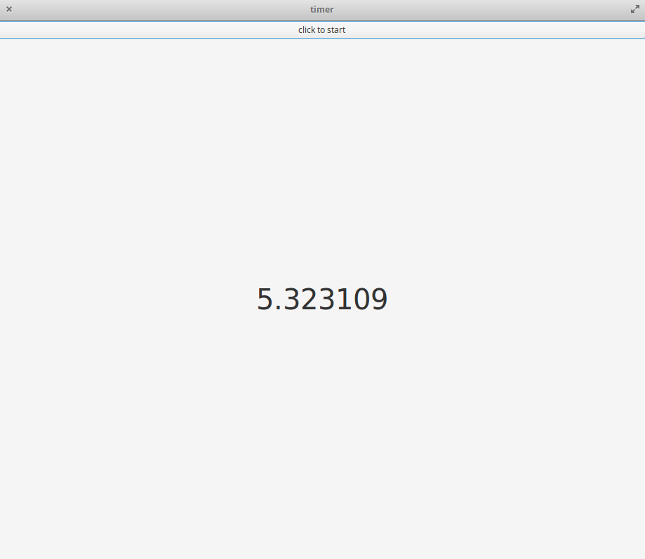

# Timer-Vala
`jskyzero` `2017/11/05`

## Overview

A basic timer program implemented in Vala



Power By
+ Vala: Vala is a new programming language that allows modern programming techniques to be used to write applications that run on the GNOME runtime libraries, particularly GLib and GObject.
+ Gtk+: GTK+ is a multi-platform toolkit for creating graphical user interfaces. Offering a complete set of widgets, GTK+ is suitable for projects ranging from small one-off tools to complete application suites.

## Install and Run

```
# install
make 
# run
./timer
```


## Reference

+ [Vala Tutorial](https://wiki.gnome.org/Projects/Vala/Tutorial)
+ [Valadoc](https://valadoc.org/index.htm)
+ [Gtk 3.0](https://lazka.github.io/pgi-docs/Gtk-3.0/index.html)